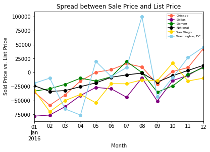
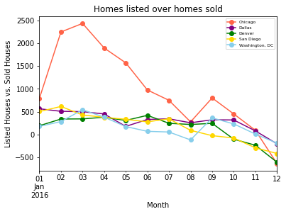

```python
import pandas as pd
import numpy as np
import matplotlib.pyplot as plt

```


```python
# Pulling data downloaded from Redfin
csv_path = "HousingDataClean.csv"
housing_df = pd.read_csv(csv_path)
housing_df.head()
```


<div>
<style>
    .dataframe thead tr:only-child th {
        text-align: right;
    }

    .dataframe thead th {
        text-align: left;
    }

    .dataframe tbody tr th {
        vertical-align: top;
    }
</style>
<table border="1" class="dataframe">
  <thead>
    <tr style="text-align: right;">
      <th></th>
      <th>City</th>
      <th>Homes Sold</th>
      <th>Inventory</th>
      <th>Median Dom</th>
      <th>Median List Price</th>
      <th>Median Sale Price</th>
      <th>New Listings</th>
      <th>Period Begin</th>
      <th>Period Duration</th>
      <th>Period End</th>
      <th>Price Drops</th>
      <th>Property Type</th>
      <th>Region</th>
    </tr>
  </thead>
  <tbody>
    <tr>
      <th>0</th>
      <td>National</td>
      <td>159514</td>
      <td>744443</td>
      <td>66</td>
      <td>266500.0</td>
      <td>243000</td>
      <td>232357</td>
      <td>1/1/16</td>
      <td>30</td>
      <td>1/31/16</td>
      <td>0.191761</td>
      <td>All Residential</td>
      <td>National</td>
    </tr>
    <tr>
      <th>1</th>
      <td>National</td>
      <td>165717</td>
      <td>765626</td>
      <td>68</td>
      <td>276700.0</td>
      <td>243000</td>
      <td>270865</td>
      <td>2/1/16</td>
      <td>30</td>
      <td>2/29/16</td>
      <td>0.180770</td>
      <td>All Residential</td>
      <td>National</td>
    </tr>
    <tr>
      <th>2</th>
      <td>National</td>
      <td>222043</td>
      <td>795934</td>
      <td>60</td>
      <td>286200.0</td>
      <td>254000</td>
      <td>340460</td>
      <td>3/1/16</td>
      <td>30</td>
      <td>3/31/16</td>
      <td>0.218335</td>
      <td>All Residential</td>
      <td>National</td>
    </tr>
    <tr>
      <th>3</th>
      <td>National</td>
      <td>234992</td>
      <td>826487</td>
      <td>50</td>
      <td>289100.0</td>
      <td>264000</td>
      <td>350319</td>
      <td>4/1/16</td>
      <td>30</td>
      <td>4/30/16</td>
      <td>0.224657</td>
      <td>All Residential</td>
      <td>National</td>
    </tr>
    <tr>
      <th>4</th>
      <td>National</td>
      <td>263957</td>
      <td>841678</td>
      <td>44</td>
      <td>287400.0</td>
      <td>269000</td>
      <td>342288</td>
      <td>5/1/16</td>
      <td>30</td>
      <td>5/31/16</td>
      <td>0.233373</td>
      <td>All Residential</td>
      <td>National</td>
    </tr>
  </tbody>
</table>
</div>


```python
#Getting the difference between list price and sold price

housing_df['ListvSold'] = housing_df['Median Sale Price'] - housing_df['Median List Price'] 
housing_df['NewvSold'] = housing_df['New Listings'] - housing_df['Homes Sold'] 
housing_df = housing_df.rename(columns={'Period Begin': 'Date'})
housing_df['Date'] = pd.to_datetime(housing_df['Date'], format='%d/%m/%y')

housing_df.head()
```


<div>
<style>
    .dataframe thead tr:only-child th {
        text-align: right;
    }

    .dataframe thead th {
        text-align: left;
    }

    .dataframe tbody tr th {
        vertical-align: top;
    }
</style>
<table border="1" class="dataframe">
  <thead>
    <tr style="text-align: right;">
      <th></th>
      <th>City</th>
      <th>Homes Sold</th>
      <th>Inventory</th>
      <th>Median Dom</th>
      <th>Median List Price</th>
      <th>Median Sale Price</th>
      <th>New Listings</th>
      <th>Date</th>
      <th>Period Duration</th>
      <th>Period End</th>
      <th>Price Drops</th>
      <th>Property Type</th>
      <th>Region</th>
      <th>ListvSold</th>
      <th>NewvSold</th>
    </tr>
  </thead>
  <tbody>
    <tr>
      <th>0</th>
      <td>National</td>
      <td>159514</td>
      <td>744443</td>
      <td>66</td>
      <td>266500.0</td>
      <td>243000</td>
      <td>232357</td>
      <td>2016-01-01</td>
      <td>30</td>
      <td>1/31/16</td>
      <td>0.191761</td>
      <td>All Residential</td>
      <td>National</td>
      <td>-23500.0</td>
      <td>72843</td>
    </tr>
    <tr>
      <th>1</th>
      <td>National</td>
      <td>165717</td>
      <td>765626</td>
      <td>68</td>
      <td>276700.0</td>
      <td>243000</td>
      <td>270865</td>
      <td>2016-01-02</td>
      <td>30</td>
      <td>2/29/16</td>
      <td>0.180770</td>
      <td>All Residential</td>
      <td>National</td>
      <td>-33700.0</td>
      <td>105148</td>
    </tr>
    <tr>
      <th>2</th>
      <td>National</td>
      <td>222043</td>
      <td>795934</td>
      <td>60</td>
      <td>286200.0</td>
      <td>254000</td>
      <td>340460</td>
      <td>2016-01-03</td>
      <td>30</td>
      <td>3/31/16</td>
      <td>0.218335</td>
      <td>All Residential</td>
      <td>National</td>
      <td>-32200.0</td>
      <td>118417</td>
    </tr>
    <tr>
      <th>3</th>
      <td>National</td>
      <td>234992</td>
      <td>826487</td>
      <td>50</td>
      <td>289100.0</td>
      <td>264000</td>
      <td>350319</td>
      <td>2016-01-04</td>
      <td>30</td>
      <td>4/30/16</td>
      <td>0.224657</td>
      <td>All Residential</td>
      <td>National</td>
      <td>-25100.0</td>
      <td>115327</td>
    </tr>
    <tr>
      <th>4</th>
      <td>National</td>
      <td>263957</td>
      <td>841678</td>
      <td>44</td>
      <td>287400.0</td>
      <td>269000</td>
      <td>342288</td>
      <td>2016-01-05</td>
      <td>30</td>
      <td>5/31/16</td>
      <td>0.233373</td>
      <td>All Residential</td>
      <td>National</td>
      <td>-18400.0</td>
      <td>78331</td>
    </tr>
  </tbody>
</table>
</div>


```python
HousingMonth = pd.pivot_table(housing_df, values='ListvSold', columns='City', index='Date')

HousingMonth.plot(kind='line', color=['Tomato', 'Purple', 'Green', 'Black', 'Gold', 'SkyBlue'] ,marker='o')

plt.title("Spread between Sale Price and List Price")
plt.xlabel("Month")
plt.ylabel("Sold Price vs. List Price")
plt.legend(loc="best", prop={'size': 6})

plt.show()

```





```python
SalesMonth = pd.pivot_table(housing_df, values='NewvSold', columns='City', index='Date')
SalesMonth.drop('National', axis=1, inplace=True)
SalesMonth.head()

SalesMonth.plot(kind='line', color=['Tomato', 'Purple', 'Green', 'Gold', 'SkyBlue'], marker="o")

plt.title("Homes listed over homes sold")
plt.xlabel("Month")
plt.ylabel("Listed Houses vs. Sold Houses")
plt.legend(loc="best", prop={'size': 6})

plt.show()
```





```python
#housing_df.plot(kind='scatter', x='Date', y='New Listings')

#plt.show()
```
