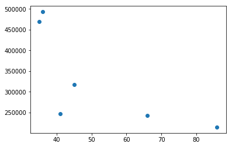
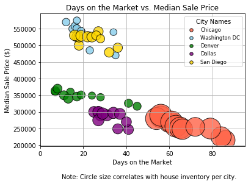
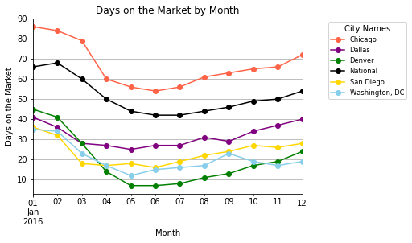

```python
import pandas as pd
import numpy as np
import matplotlib.pyplot as plt
import seaborn as sns

housing_file = "HousingDataClean.csv"

housing_data = pd.read_csv(housing_file)
housing_data
```


<div>
<style>
    .dataframe thead tr:only-child th {
        text-align: right;
    }

    .dataframe thead th {
        text-align: left;
    }

    .dataframe tbody tr th {
        vertical-align: top;
    }
</style>
<table border="1" class="dataframe">
  <thead>
    <tr style="text-align: right;">
      <th></th>
      <th>City</th>
      <th>Homes Sold</th>
      <th>Inventory</th>
      <th>Median Dom</th>
      <th>Median List Price</th>
      <th>Median Sale Price</th>
      <th>New Listings</th>
      <th>Period Begin</th>
      <th>Period Duration</th>
      <th>Period End</th>
      <th>Price Drops</th>
      <th>Property Type</th>
      <th>Region</th>
    </tr>
  </thead>
  <tbody>
    <tr>
      <th>0</th>
      <td>National</td>
      <td>159514</td>
      <td>744443</td>
      <td>66</td>
      <td>266500.0</td>
      <td>243000</td>
      <td>232357</td>
      <td>1/1/16</td>
      <td>30</td>
      <td>1/31/16</td>
      <td>0.191761</td>
      <td>All Residential</td>
      <td>National</td>
    </tr>
    <tr>
      <th>1</th>
      <td>National</td>
      <td>165717</td>
      <td>765626</td>
      <td>68</td>
      <td>276700.0</td>
      <td>243000</td>
      <td>270865</td>
      <td>2/1/16</td>
      <td>30</td>
      <td>2/29/16</td>
      <td>0.180770</td>
      <td>All Residential</td>
      <td>National</td>
    </tr>
    <tr>
      <th>2</th>
      <td>National</td>
      <td>222043</td>
      <td>795934</td>
      <td>60</td>
      <td>286200.0</td>
      <td>254000</td>
      <td>340460</td>
      <td>3/1/16</td>
      <td>30</td>
      <td>3/31/16</td>
      <td>0.218335</td>
      <td>All Residential</td>
      <td>National</td>
    </tr>
    <tr>
      <th>3</th>
      <td>National</td>
      <td>234992</td>
      <td>826487</td>
      <td>50</td>
      <td>289100.0</td>
      <td>264000</td>
      <td>350319</td>
      <td>4/1/16</td>
      <td>30</td>
      <td>4/30/16</td>
      <td>0.224657</td>
      <td>All Residential</td>
      <td>National</td>
    </tr>
    <tr>
      <th>4</th>
      <td>National</td>
      <td>263957</td>
      <td>841678</td>
      <td>44</td>
      <td>287400.0</td>
      <td>269000</td>
      <td>342288</td>
      <td>5/1/16</td>
      <td>30</td>
      <td>5/31/16</td>
      <td>0.233373</td>
      <td>All Residential</td>
      <td>National</td>
    </tr>
    <tr>
      <th>5</th>
      <td>National</td>
      <td>299010</td>
      <td>854863</td>
      <td>42</td>
      <td>284400.0</td>
      <td>276000</td>
      <td>344182</td>
      <td>6/1/16</td>
      <td>30</td>
      <td>6/30/16</td>
      <td>0.254142</td>
      <td>All Residential</td>
      <td>National</td>
    </tr>
    <tr>
      <th>6</th>
      <td>National</td>
      <td>263730</td>
      <td>863238</td>
      <td>42</td>
      <td>278100.0</td>
      <td>274000</td>
      <td>311734</td>
      <td>7/1/16</td>
      <td>30</td>
      <td>7/31/16</td>
      <td>0.246911</td>
      <td>All Residential</td>
      <td>National</td>
    </tr>
    <tr>
      <th>7</th>
      <td>National</td>
      <td>282330</td>
      <td>844062</td>
      <td>44</td>
      <td>271800.0</td>
      <td>271000</td>
      <td>303370</td>
      <td>8/1/16</td>
      <td>30</td>
      <td>8/31/16</td>
      <td>0.258495</td>
      <td>All Residential</td>
      <td>National</td>
    </tr>
    <tr>
      <th>8</th>
      <td>National</td>
      <td>250025</td>
      <td>836653</td>
      <td>46</td>
      <td>283900.0</td>
      <td>267000</td>
      <td>281271</td>
      <td>9/1/16</td>
      <td>30</td>
      <td>9/30/16</td>
      <td>0.245363</td>
      <td>All Residential</td>
      <td>National</td>
    </tr>
    <tr>
      <th>9</th>
      <td>National</td>
      <td>228331</td>
      <td>806581</td>
      <td>49</td>
      <td>274600.0</td>
      <td>269000</td>
      <td>248987</td>
      <td>10/1/16</td>
      <td>30</td>
      <td>10/31/16</td>
      <td>0.237136</td>
      <td>All Residential</td>
      <td>National</td>
    </tr>
    <tr>
      <th>10</th>
      <td>National</td>
      <td>216798</td>
      <td>751114</td>
      <td>50</td>
      <td>267100.0</td>
      <td>271000</td>
      <td>206066</td>
      <td>11/1/16</td>
      <td>30</td>
      <td>11/30/16</td>
      <td>0.217689</td>
      <td>All Residential</td>
      <td>National</td>
    </tr>
    <tr>
      <th>11</th>
      <td>National</td>
      <td>224604</td>
      <td>667806</td>
      <td>54</td>
      <td>255100.0</td>
      <td>268000</td>
      <td>152273</td>
      <td>12/1/16</td>
      <td>30</td>
      <td>12/31/16</td>
      <td>0.153567</td>
      <td>All Residential</td>
      <td>National</td>
    </tr>
    <tr>
      <th>12</th>
      <td>Chicago</td>
      <td>2098</td>
      <td>10078</td>
      <td>86</td>
      <td>249900.0</td>
      <td>215000</td>
      <td>2887</td>
      <td>1/1/16</td>
      <td>30</td>
      <td>1/31/16</td>
      <td>0.142985</td>
      <td>All Residential</td>
      <td>Chicago, IL</td>
    </tr>
    <tr>
      <th>13</th>
      <td>Chicago</td>
      <td>1876</td>
      <td>10969</td>
      <td>84</td>
      <td>283450.0</td>
      <td>225000</td>
      <td>4130</td>
      <td>2/1/16</td>
      <td>30</td>
      <td>2/29/16</td>
      <td>0.146868</td>
      <td>All Residential</td>
      <td>Chicago, IL</td>
    </tr>
    <tr>
      <th>14</th>
      <td>Chicago</td>
      <td>2393</td>
      <td>11762</td>
      <td>79</td>
      <td>289900.0</td>
      <td>250000</td>
      <td>4835</td>
      <td>3/1/16</td>
      <td>30</td>
      <td>3/31/16</td>
      <td>0.165023</td>
      <td>All Residential</td>
      <td>Chicago, IL</td>
    </tr>
    <tr>
      <th>15</th>
      <td>Chicago</td>
      <td>2908</td>
      <td>12285</td>
      <td>60</td>
      <td>285000.0</td>
      <td>270000</td>
      <td>4809</td>
      <td>4/1/16</td>
      <td>30</td>
      <td>4/30/16</td>
      <td>0.167114</td>
      <td>All Residential</td>
      <td>Chicago, IL</td>
    </tr>
    <tr>
      <th>16</th>
      <td>Chicago</td>
      <td>3204</td>
      <td>12723</td>
      <td>56</td>
      <td>284450.0</td>
      <td>285000</td>
      <td>4778</td>
      <td>5/1/16</td>
      <td>30</td>
      <td>5/31/16</td>
      <td>0.179203</td>
      <td>All Residential</td>
      <td>Chicago, IL</td>
    </tr>
    <tr>
      <th>17</th>
      <td>Chicago</td>
      <td>3692</td>
      <td>12990</td>
      <td>54</td>
      <td>274724.0</td>
      <td>280000</td>
      <td>4669</td>
      <td>6/1/16</td>
      <td>30</td>
      <td>6/30/16</td>
      <td>0.206236</td>
      <td>All Residential</td>
      <td>Chicago, IL</td>
    </tr>
    <tr>
      <th>18</th>
      <td>Chicago</td>
      <td>3343</td>
      <td>13054</td>
      <td>56</td>
      <td>274000.0</td>
      <td>290000</td>
      <td>4092</td>
      <td>7/1/16</td>
      <td>30</td>
      <td>7/31/16</td>
      <td>0.199326</td>
      <td>All Residential</td>
      <td>Chicago, IL</td>
    </tr>
    <tr>
      <th>19</th>
      <td>Chicago</td>
      <td>3628</td>
      <td>12691</td>
      <td>61</td>
      <td>259900.0</td>
      <td>270000</td>
      <td>3902</td>
      <td>8/1/16</td>
      <td>30</td>
      <td>8/31/16</td>
      <td>0.214798</td>
      <td>All Residential</td>
      <td>Chicago, IL</td>
    </tr>
    <tr>
      <th>20</th>
      <td>Chicago</td>
      <td>3020</td>
      <td>12853</td>
      <td>63</td>
      <td>277450.0</td>
      <td>257000</td>
      <td>3821</td>
      <td>9/1/16</td>
      <td>30</td>
      <td>9/30/16</td>
      <td>0.227262</td>
      <td>All Residential</td>
      <td>Chicago, IL</td>
    </tr>
    <tr>
      <th>21</th>
      <td>Chicago</td>
      <td>2660</td>
      <td>12356</td>
      <td>65</td>
      <td>250000.0</td>
      <td>252000</td>
      <td>3109</td>
      <td>10/1/16</td>
      <td>30</td>
      <td>10/31/16</td>
      <td>0.210991</td>
      <td>All Residential</td>
      <td>Chicago, IL</td>
    </tr>
    <tr>
      <th>22</th>
      <td>Chicago</td>
      <td>2339</td>
      <td>11338</td>
      <td>66</td>
      <td>239000.0</td>
      <td>248000</td>
      <td>2429</td>
      <td>11/1/16</td>
      <td>30</td>
      <td>11/30/16</td>
      <td>0.175428</td>
      <td>All Residential</td>
      <td>Chicago, IL</td>
    </tr>
    <tr>
      <th>23</th>
      <td>Chicago</td>
      <td>2321</td>
      <td>9538</td>
      <td>72</td>
      <td>212000.0</td>
      <td>255000</td>
      <td>1679</td>
      <td>12/1/16</td>
      <td>30</td>
      <td>12/31/16</td>
      <td>0.132942</td>
      <td>All Residential</td>
      <td>Chicago, IL</td>
    </tr>
    <tr>
      <th>24</th>
      <td>Dallas</td>
      <td>736</td>
      <td>2687</td>
      <td>41</td>
      <td>324900.0</td>
      <td>247000</td>
      <td>1299</td>
      <td>1/1/16</td>
      <td>30</td>
      <td>1/31/16</td>
      <td>0.207294</td>
      <td>All Residential</td>
      <td>Dallas, TX</td>
    </tr>
    <tr>
      <th>25</th>
      <td>Dallas</td>
      <td>975</td>
      <td>2776</td>
      <td>36</td>
      <td>325000.0</td>
      <td>249000</td>
      <td>1482</td>
      <td>2/1/16</td>
      <td>30</td>
      <td>2/29/16</td>
      <td>0.195965</td>
      <td>All Residential</td>
      <td>Dallas, TX</td>
    </tr>
    <tr>
      <th>26</th>
      <td>Dallas</td>
      <td>1293</td>
      <td>3062</td>
      <td>28</td>
      <td>349900.0</td>
      <td>289000</td>
      <td>1792</td>
      <td>3/1/16</td>
      <td>30</td>
      <td>3/31/16</td>
      <td>0.230242</td>
      <td>All Residential</td>
      <td>Dallas, TX</td>
    </tr>
    <tr>
      <th>27</th>
      <td>Dallas</td>
      <td>1265</td>
      <td>3196</td>
      <td>27</td>
      <td>340000.0</td>
      <td>299000</td>
      <td>1714</td>
      <td>4/1/16</td>
      <td>30</td>
      <td>4/30/16</td>
      <td>0.239675</td>
      <td>All Residential</td>
      <td>Dallas, TX</td>
    </tr>
    <tr>
      <th>28</th>
      <td>Dallas</td>
      <td>1413</td>
      <td>3208</td>
      <td>25</td>
      <td>326500.0</td>
      <td>300000</td>
      <td>1588</td>
      <td>5/1/16</td>
      <td>30</td>
      <td>5/31/16</td>
      <td>0.247818</td>
      <td>All Residential</td>
      <td>Dallas, TX</td>
    </tr>
    <tr>
      <th>29</th>
      <td>Dallas</td>
      <td>1337</td>
      <td>3352</td>
      <td>27</td>
      <td>329000.0</td>
      <td>300000</td>
      <td>1664</td>
      <td>6/1/16</td>
      <td>30</td>
      <td>6/30/16</td>
      <td>0.283115</td>
      <td>All Residential</td>
      <td>Dallas, TX</td>
    </tr>
    <tr>
      <th>...</th>
      <td>...</td>
      <td>...</td>
      <td>...</td>
      <td>...</td>
      <td>...</td>
      <td>...</td>
      <td>...</td>
      <td>...</td>
      <td>...</td>
      <td>...</td>
      <td>...</td>
      <td>...</td>
      <td>...</td>
    </tr>
    <tr>
      <th>42</th>
      <td>Denver</td>
      <td>1424</td>
      <td>2151</td>
      <td>8</td>
      <td>350000.0</td>
      <td>370000</td>
      <td>1667</td>
      <td>7/1/16</td>
      <td>30</td>
      <td>7/31/16</td>
      <td>0.387262</td>
      <td>All Residential</td>
      <td>Denver, CO</td>
    </tr>
    <tr>
      <th>43</th>
      <td>Denver</td>
      <td>1506</td>
      <td>2218</td>
      <td>11</td>
      <td>350000.0</td>
      <td>350000</td>
      <td>1723</td>
      <td>8/1/16</td>
      <td>30</td>
      <td>8/31/16</td>
      <td>0.418846</td>
      <td>All Residential</td>
      <td>Denver, CO</td>
    </tr>
    <tr>
      <th>44</th>
      <td>Denver</td>
      <td>1364</td>
      <td>2309</td>
      <td>13</td>
      <td>374950.0</td>
      <td>340000</td>
      <td>1606</td>
      <td>9/1/16</td>
      <td>30</td>
      <td>9/30/16</td>
      <td>0.393677</td>
      <td>All Residential</td>
      <td>Denver, CO</td>
    </tr>
    <tr>
      <th>45</th>
      <td>Denver</td>
      <td>1329</td>
      <td>2089</td>
      <td>17</td>
      <td>369900.0</td>
      <td>346000</td>
      <td>1222</td>
      <td>10/1/16</td>
      <td>30</td>
      <td>10/31/16</td>
      <td>0.372427</td>
      <td>All Residential</td>
      <td>Denver, CO</td>
    </tr>
    <tr>
      <th>46</th>
      <td>Denver</td>
      <td>1202</td>
      <td>1769</td>
      <td>19</td>
      <td>354200.0</td>
      <td>351000</td>
      <td>962</td>
      <td>11/1/16</td>
      <td>30</td>
      <td>11/30/16</td>
      <td>0.306388</td>
      <td>All Residential</td>
      <td>Denver, CO</td>
    </tr>
    <tr>
      <th>47</th>
      <td>Denver</td>
      <td>1258</td>
      <td>1424</td>
      <td>24</td>
      <td>339900.0</td>
      <td>349000</td>
      <td>645</td>
      <td>12/1/16</td>
      <td>30</td>
      <td>12/31/16</td>
      <td>0.191011</td>
      <td>All Residential</td>
      <td>Denver, CO</td>
    </tr>
    <tr>
      <th>48</th>
      <td>San Diego</td>
      <td>895</td>
      <td>2365</td>
      <td>36</td>
      <td>525000.0</td>
      <td>493000</td>
      <td>1396</td>
      <td>1/1/16</td>
      <td>30</td>
      <td>1/31/16</td>
      <td>0.177167</td>
      <td>All Residential</td>
      <td>San Diego, CA</td>
    </tr>
    <tr>
      <th>49</th>
      <td>San Diego</td>
      <td>992</td>
      <td>2458</td>
      <td>32</td>
      <td>549000.0</td>
      <td>479000</td>
      <td>1606</td>
      <td>2/1/16</td>
      <td>30</td>
      <td>2/29/16</td>
      <td>0.205045</td>
      <td>All Residential</td>
      <td>San Diego, CA</td>
    </tr>
    <tr>
      <th>50</th>
      <td>San Diego</td>
      <td>1383</td>
      <td>2517</td>
      <td>18</td>
      <td>550000.0</td>
      <td>500000</td>
      <td>1809</td>
      <td>3/1/16</td>
      <td>30</td>
      <td>3/31/16</td>
      <td>0.232022</td>
      <td>All Residential</td>
      <td>San Diego, CA</td>
    </tr>
    <tr>
      <th>51</th>
      <td>San Diego</td>
      <td>1528</td>
      <td>2658</td>
      <td>17</td>
      <td>565000.0</td>
      <td>526000</td>
      <td>1903</td>
      <td>4/1/16</td>
      <td>30</td>
      <td>4/30/16</td>
      <td>0.244921</td>
      <td>All Residential</td>
      <td>San Diego, CA</td>
    </tr>
    <tr>
      <th>52</th>
      <td>San Diego</td>
      <td>1525</td>
      <td>2717</td>
      <td>18</td>
      <td>579000.0</td>
      <td>525000</td>
      <td>1856</td>
      <td>5/1/16</td>
      <td>30</td>
      <td>5/31/16</td>
      <td>0.262422</td>
      <td>All Residential</td>
      <td>San Diego, CA</td>
    </tr>
    <tr>
      <th>53</th>
      <td>San Diego</td>
      <td>1674</td>
      <td>2978</td>
      <td>16</td>
      <td>549900.0</td>
      <td>530000</td>
      <td>1949</td>
      <td>6/1/16</td>
      <td>30</td>
      <td>6/30/16</td>
      <td>0.286098</td>
      <td>All Residential</td>
      <td>San Diego, CA</td>
    </tr>
    <tr>
      <th>54</th>
      <td>San Diego</td>
      <td>1470</td>
      <td>3087</td>
      <td>19</td>
      <td>549000.0</td>
      <td>529000</td>
      <td>1812</td>
      <td>7/1/16</td>
      <td>30</td>
      <td>7/31/16</td>
      <td>0.284095</td>
      <td>All Residential</td>
      <td>San Diego, CA</td>
    </tr>
    <tr>
      <th>55</th>
      <td>San Diego</td>
      <td>1567</td>
      <td>2966</td>
      <td>22</td>
      <td>539000.0</td>
      <td>526000</td>
      <td>1655</td>
      <td>8/1/16</td>
      <td>30</td>
      <td>8/31/16</td>
      <td>0.323331</td>
      <td>All Residential</td>
      <td>San Diego, CA</td>
    </tr>
    <tr>
      <th>56</th>
      <td>San Diego</td>
      <td>1477</td>
      <td>2678</td>
      <td>24</td>
      <td>539450.0</td>
      <td>525000</td>
      <td>1448</td>
      <td>9/1/16</td>
      <td>30</td>
      <td>9/30/16</td>
      <td>0.318148</td>
      <td>All Residential</td>
      <td>San Diego, CA</td>
    </tr>
    <tr>
      <th>57</th>
      <td>San Diego</td>
      <td>1390</td>
      <td>2448</td>
      <td>27</td>
      <td>525000.0</td>
      <td>542000</td>
      <td>1309</td>
      <td>10/1/16</td>
      <td>30</td>
      <td>10/31/16</td>
      <td>0.272059</td>
      <td>All Residential</td>
      <td>San Diego, CA</td>
    </tr>
    <tr>
      <th>58</th>
      <td>San Diego</td>
      <td>1346</td>
      <td>2233</td>
      <td>26</td>
      <td>545000.0</td>
      <td>530000</td>
      <td>1049</td>
      <td>11/1/16</td>
      <td>30</td>
      <td>11/30/16</td>
      <td>0.228840</td>
      <td>All Residential</td>
      <td>San Diego, CA</td>
    </tr>
    <tr>
      <th>59</th>
      <td>San Diego</td>
      <td>1193</td>
      <td>1843</td>
      <td>28</td>
      <td>530000.0</td>
      <td>520000</td>
      <td>772</td>
      <td>12/1/16</td>
      <td>30</td>
      <td>12/31/16</td>
      <td>0.176886</td>
      <td>All Residential</td>
      <td>San Diego, CA</td>
    </tr>
    <tr>
      <th>60</th>
      <td>Washington, DC</td>
      <td>515</td>
      <td>1320</td>
      <td>35</td>
      <td>489000.0</td>
      <td>470000</td>
      <td>689</td>
      <td>1/1/16</td>
      <td>30</td>
      <td>1/31/16</td>
      <td>0.184848</td>
      <td>All Residential</td>
      <td>Washington, DC</td>
    </tr>
    <tr>
      <th>61</th>
      <td>Washington, DC</td>
      <td>513</td>
      <td>1289</td>
      <td>34</td>
      <td>549900.0</td>
      <td>540000</td>
      <td>794</td>
      <td>2/1/16</td>
      <td>30</td>
      <td>2/29/16</td>
      <td>0.211792</td>
      <td>All Residential</td>
      <td>Washington, DC</td>
    </tr>
    <tr>
      <th>62</th>
      <td>Washington, DC</td>
      <td>686</td>
      <td>1498</td>
      <td>23</td>
      <td>550000.0</td>
      <td>485000</td>
      <td>1227</td>
      <td>3/1/16</td>
      <td>30</td>
      <td>3/31/16</td>
      <td>0.218959</td>
      <td>All Residential</td>
      <td>Washington, DC</td>
    </tr>
    <tr>
      <th>63</th>
      <td>Washington, DC</td>
      <td>794</td>
      <td>1535</td>
      <td>17</td>
      <td>599000.0</td>
      <td>523000</td>
      <td>1172</td>
      <td>4/1/16</td>
      <td>30</td>
      <td>4/30/16</td>
      <td>0.284039</td>
      <td>All Residential</td>
      <td>Washington, DC</td>
    </tr>
    <tr>
      <th>64</th>
      <td>Washington, DC</td>
      <td>883</td>
      <td>1547</td>
      <td>12</td>
      <td>549900.0</td>
      <td>570000</td>
      <td>1054</td>
      <td>5/1/16</td>
      <td>30</td>
      <td>5/31/16</td>
      <td>0.277957</td>
      <td>All Residential</td>
      <td>Washington, DC</td>
    </tr>
    <tr>
      <th>65</th>
      <td>Washington, DC</td>
      <td>952</td>
      <td>1525</td>
      <td>15</td>
      <td>557000.0</td>
      <td>550000</td>
      <td>1018</td>
      <td>6/1/16</td>
      <td>30</td>
      <td>6/30/16</td>
      <td>0.290492</td>
      <td>All Residential</td>
      <td>Washington, DC</td>
    </tr>
    <tr>
      <th>66</th>
      <td>Washington, DC</td>
      <td>819</td>
      <td>1480</td>
      <td>16</td>
      <td>549000.0</td>
      <td>558000</td>
      <td>870</td>
      <td>7/1/16</td>
      <td>30</td>
      <td>7/31/16</td>
      <td>0.250000</td>
      <td>All Residential</td>
      <td>Washington, DC</td>
    </tr>
    <tr>
      <th>67</th>
      <td>Washington, DC</td>
      <td>823</td>
      <td>1346</td>
      <td>17</td>
      <td>474825.0</td>
      <td>575000</td>
      <td>700</td>
      <td>8/1/16</td>
      <td>30</td>
      <td>8/31/16</td>
      <td>0.235513</td>
      <td>All Residential</td>
      <td>Washington, DC</td>
    </tr>
    <tr>
      <th>68</th>
      <td>Washington, DC</td>
      <td>776</td>
      <td>1605</td>
      <td>23</td>
      <td>572197.5</td>
      <td>529000</td>
      <td>1137</td>
      <td>9/1/16</td>
      <td>30</td>
      <td>9/30/16</td>
      <td>0.234268</td>
      <td>All Residential</td>
      <td>Washington, DC</td>
    </tr>
    <tr>
      <th>69</th>
      <td>Washington, DC</td>
      <td>693</td>
      <td>1569</td>
      <td>19</td>
      <td>552000.0</td>
      <td>543000</td>
      <td>923</td>
      <td>10/1/16</td>
      <td>30</td>
      <td>10/31/16</td>
      <td>0.273423</td>
      <td>All Residential</td>
      <td>Washington, DC</td>
    </tr>
    <tr>
      <th>70</th>
      <td>Washington, DC</td>
      <td>732</td>
      <td>1533</td>
      <td>17</td>
      <td>524000.0</td>
      <td>551000</td>
      <td>738</td>
      <td>11/1/16</td>
      <td>30</td>
      <td>11/30/16</td>
      <td>0.241357</td>
      <td>All Residential</td>
      <td>Washington, DC</td>
    </tr>
    <tr>
      <th>71</th>
      <td>Washington, DC</td>
      <td>712</td>
      <td>1312</td>
      <td>19</td>
      <td>498450.0</td>
      <td>544000</td>
      <td>519</td>
      <td>12/1/16</td>
      <td>30</td>
      <td>12/31/16</td>
      <td>0.181402</td>
      <td>All Residential</td>
      <td>Washington, DC</td>
    </tr>
  </tbody>
</table>
<p>72 rows × 13 columns</p>
</div>


```python
housing_data.columns
```


    Index(['City', 'Homes Sold', 'Inventory', 'Median Dom', 'Median List Price',
           'Median Sale Price', 'New Listings', 'Period Begin', 'Period Duration',
           'Period End', 'Price Drops', 'Property Type', 'Region'],
          dtype='object')


```python
#Create scatter plot for days on the market vs. median sale price per city per month 
january_data = housing_data[housing_data["Period End"] == "1/31/16"]
january_median_price = january_data["Median Sale Price"]
january_median_dom = january_data["Median Dom"]
```


```python
#Bubble Chart = month on x-axis, median sale price on y-axis, size of bubble will be median dom, color will be city 
```


```python
plt.scatter(january_median_dom,january_median_price)
```


    <matplotlib.collections.PathCollection at 0x1a1b2fc438>


```python
plt.show()
```





```python
#Bubble chart 
chicago_data = housing_data[housing_data['Region'] == 'Chicago, IL']
dc_data = housing_data[housing_data['Region'] == 'Washington, DC']
denver_data = housing_data[housing_data['Region'] == 'Denver, CO']
dallas_data = housing_data[housing_data['Region'] == 'Dallas, TX']
san_diego_data = housing_data[housing_data['Region'] == 'San Diego, CA']
national_data = housing_data[housing_data['City'] == 'National']


```


```python
plt.scatter(chicago_data["Median Dom"], 
            chicago_data["Median Sale Price"], c="tomato",
            s=chicago_data["Inventory"]*.1,
                 edgecolor ="black",
                linewidths=1, marker="o", alpha=0.8, label="Chicago")

plt.scatter(dc_data["Median Dom"], 
            dc_data["Median Sale Price"], c="skyblue", 
            s=dc_data["Inventory"]*.1,
                 edgecolor ="black",
                linewidths=1, marker="o", alpha=0.8, label="Washington DC")

plt.scatter(denver_data["Median Dom"], 
            denver_data["Median Sale Price"],c="green",
            s=denver_data["Inventory"]*.1,
                 edgecolor ="black",
                linewidths=1, marker="o", alpha=0.8, label="Denver")

plt.scatter(dallas_data["Median Dom"], 
            dallas_data["Median Sale Price"], c="purple", 
            s=dallas_data["Inventory"]*.1,
                 edgecolor ="black",
                linewidths=1, marker="o", alpha=0.8, label="Dallas")

plt.scatter(san_diego_data["Median Dom"], 
            san_diego_data["Median Sale Price"],c="gold",
            s=san_diego_data["Inventory"]*.1,
                 edgecolor ="black",
                linewidths=1, marker="o", alpha=0.8, label="San Diego")
'''plt.scatter(national_data["Median Dom"],
           national_data["Median Sale Price"], c="orange",
           s=national_data["Inventory"]*.1, edgecolor = "black",
            linewidths=1, marker="o", alpha=0.8, label="National")'''


plt.xlim(0,95)
lgnd = plt.legend(fontsize="small",mode = "Expanded",
                  numpoints=1, scatterpoints=1, 
                  loc="best", title="City Names", 
                  labelspacing=0.5)
lgnd.legendHandles[0]._sizes = [30]
lgnd.legendHandles[1]._sizes = [30]
lgnd.legendHandles[2]._sizes = [30]
lgnd.legendHandles[3]._sizes = [30]
lgnd.legendHandles[4]._sizes = [30]

plt.grid(True)
plt.title("Days on the Market vs. Median Sale Price")
plt.xlabel("Days on the Market")
plt.ylabel("Median Sale Price ($)")
plt.text(10,100000,"Note: Circle size correlates with house inventory per city.")

plt.show()
```





```python
housing_data=housing_data.rename(columns={'Period Begin':'Date'})
housing_data['Date']=pd.to_datetime(housing_data['Date'],format='%d/%m/%y')
housing_data.head()
```


<div>
<style>
    .dataframe thead tr:only-child th {
        text-align: right;
    }

    .dataframe thead th {
        text-align: left;
    }

    .dataframe tbody tr th {
        vertical-align: top;
    }
</style>
<table border="1" class="dataframe">
  <thead>
    <tr style="text-align: right;">
      <th></th>
      <th>City</th>
      <th>Homes Sold</th>
      <th>Inventory</th>
      <th>Median Dom</th>
      <th>Median List Price</th>
      <th>Median Sale Price</th>
      <th>New Listings</th>
      <th>Date</th>
      <th>Period Duration</th>
      <th>Period End</th>
      <th>Price Drops</th>
      <th>Property Type</th>
      <th>Region</th>
    </tr>
  </thead>
  <tbody>
    <tr>
      <th>0</th>
      <td>National</td>
      <td>159514</td>
      <td>744443</td>
      <td>66</td>
      <td>266500.0</td>
      <td>243000</td>
      <td>232357</td>
      <td>2016-01-01</td>
      <td>30</td>
      <td>1/31/16</td>
      <td>0.191761</td>
      <td>All Residential</td>
      <td>National</td>
    </tr>
    <tr>
      <th>1</th>
      <td>National</td>
      <td>165717</td>
      <td>765626</td>
      <td>68</td>
      <td>276700.0</td>
      <td>243000</td>
      <td>270865</td>
      <td>2016-01-02</td>
      <td>30</td>
      <td>2/29/16</td>
      <td>0.180770</td>
      <td>All Residential</td>
      <td>National</td>
    </tr>
    <tr>
      <th>2</th>
      <td>National</td>
      <td>222043</td>
      <td>795934</td>
      <td>60</td>
      <td>286200.0</td>
      <td>254000</td>
      <td>340460</td>
      <td>2016-01-03</td>
      <td>30</td>
      <td>3/31/16</td>
      <td>0.218335</td>
      <td>All Residential</td>
      <td>National</td>
    </tr>
    <tr>
      <th>3</th>
      <td>National</td>
      <td>234992</td>
      <td>826487</td>
      <td>50</td>
      <td>289100.0</td>
      <td>264000</td>
      <td>350319</td>
      <td>2016-01-04</td>
      <td>30</td>
      <td>4/30/16</td>
      <td>0.224657</td>
      <td>All Residential</td>
      <td>National</td>
    </tr>
    <tr>
      <th>4</th>
      <td>National</td>
      <td>263957</td>
      <td>841678</td>
      <td>44</td>
      <td>287400.0</td>
      <td>269000</td>
      <td>342288</td>
      <td>2016-01-05</td>
      <td>30</td>
      <td>5/31/16</td>
      <td>0.233373</td>
      <td>All Residential</td>
      <td>National</td>
    </tr>
  </tbody>
</table>
</div>


```python
chicago_data = housing_data[housing_data['Region'] == 'Chicago, IL']
dc_data = housing_data[housing_data['Region'] == 'Washington, DC']
denver_data = housing_data[housing_data['Region'] == 'Denver, CO']
dallas_data = housing_data[housing_data['Region'] == 'Dallas, TX']
san_diego_data = housing_data[housing_data['Region'] == 'San Diego, CA']
national_data = housing_data[housing_data['Region'] == 'National']

```


```python
Days_on_market = pd.pivot_table(housing_data, values="Median Dom", columns="City", index="Date")
Days_on_market.plot(kind="line", marker="o", color=["Tomato", "Purple","Green","Black", "Gold", "Skyblue"])
lgnd = plt.legend(fontsize="small",mode = "Expanded",
                  numpoints=1, scatterpoints=1, 
                  loc="upper right", bbox_to_anchor =(1.4,1), 
                  title="City Names")

plt.grid(True)
plt.title("Days on the Market by Month")
plt.xlabel("Month")
plt.ylabel("Days on the Market")
plt.show()
```




